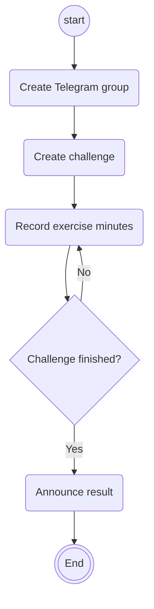

```mermaid
flowchart TB
    start((start)) --> group(Create Telegram group) --> challenge(Create challenge) --> record(Record exercise minutes) --> finished{Challenge finished?}

    finished -- No --> record
    finished -- Yes --> result(Announce result) --> e(((End)))
```