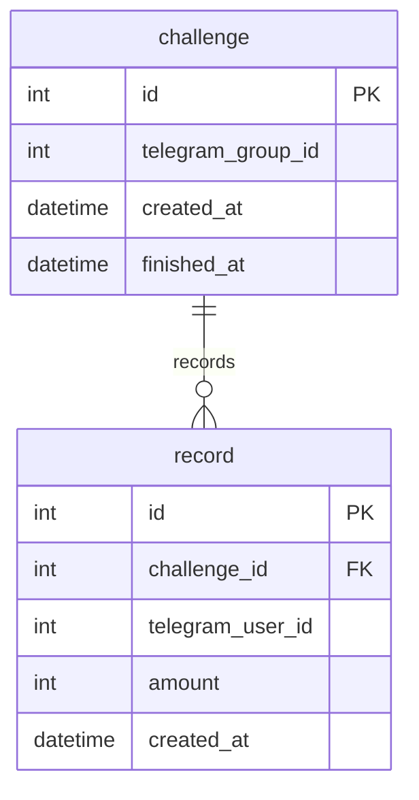

```mermaid
erDiagram
    challenge {
        int id PK
        int telegram_group_id
        datetime created_at
        datetime finished_at
    }
    challenge ||--o{ record : records

    record {
        int id PK
        int challenge_id FK
        int telegram_user_id
        int amount
        datetime created_at
    }
```