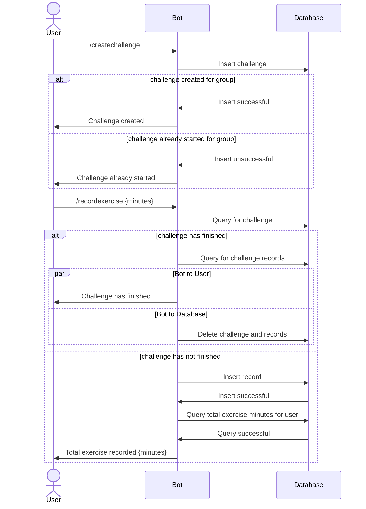

```mermaid
sequenceDiagram
    actor User
    participant Bot
    participant Database

    User->>Bot: /createchallenge
    Bot->>Database: Insert challenge

    alt challenge created for group
        Database->>Bot: Insert successful
        Bot->>User: Challenge created
    else challenge already started for group
        Database->>Bot: Insert unsuccessful
        Bot->>User: Challenge already started
    end

    User->>Bot: /recordexercise {minutes}
    Bot->>Database: Query for challenge

    alt challenge has finished
        Bot->>Database: Query for challenge records

        par Bot to User
            Bot->>User: Challenge has finished
        and Bot to Database
            Bot->>Database: Delete challenge and records
        end

    else challenge has not finished
        Bot->>Database: Insert record
        Database->>Bot: Insert successful
        Bot->>Database: Query total exercise minutes for user
        Database->>Bot: Query successful
        Bot->>User: Total exercise recorded {minutes}
    end
```